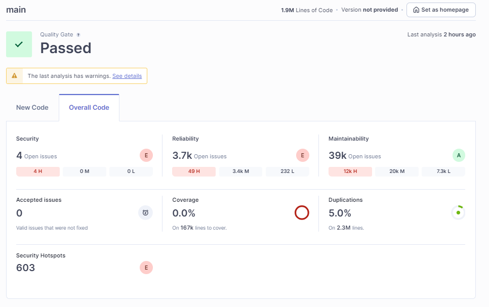
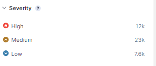
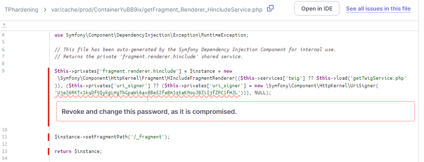
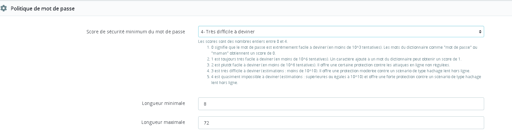

Afin d'évaluer la solidité du site, nous avons soumis le code à l'outil Sonarqube.

### Liste des commandes

- Téléchargement du code depuis Docker.

- Dans le terminal:
  sonar-scanner.bat -D <clef privée> "sonar.projectKey=TPhardening" -D"sonar.sources=." -D"sonar.host.url=http://localhost:9000"

 ### Résultats

 Il est apparu que le code était vulnérables à plusieurs CVE.

 

Parmi les principales vulnérabilités, on note la présence d'un token en dur à l'intérieur du code.

Ci-après la liste des CVE selon les points d'entée du site.

### Recommandations

Il faudrait intégrer au projet un linter qui permettrait de corriger de nombreux défauts en imposant une même nomenclature à toute l'équipe de devs.
De nombreuses variables sont mal déclarées, mal utilisées, selon le rapport de Sonarqube.
Cela permettrait également de s'assurer que toute l'équipe travaille avec le même environnement, les mêmes règles de gestion, aisni qu'un premier contrôle sur les différents éléments de sécurité.

Une modification de la politique des mots de passe utilisateurs est également à prévoir.
